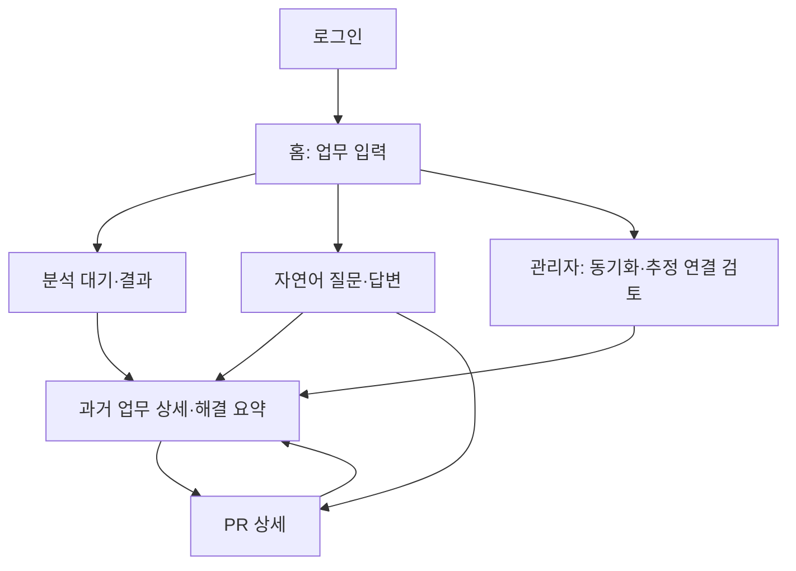

# 화면 흐름과 간단한 와이어프레임

버전 0.2 · 1인 개발 MVP · [기능명세서와 유즈케이스](01-functional-spec.md)

## 1. 화면 흐름



## 2. 화면별 계약

| ID / 화면 | 주요 요소 | 버튼·이동 | 빈 화면·오류 |
| --- | --- | --- | --- |
| S01 로그인 | 아이디·비밀번호, 초기 비밀번호 변경 폼 | 로그인 → 홈, 최초 로그인 → 비밀번호 변경 | 인증 실패 안내. 계정 존재 여부는 구별하지 않음 |
| S02 홈 | 이슈 키/업무 설명 입력 전환, 검색 대상 scope와 마지막 동기화 시각, 내 최근 분석 5건 | 분석 요청 → S03, 질문하기 → S06, 관리자 → S07 | scope가 없으면 "검색 가능한 프로젝트가 없습니다. 관리자에게 요청해 주세요." 이슈 키 형식 오류는 즉시 표시 |
| S03 분석 대기·결과 | 진행 단계, 요청 해석(AI 추정 배지), 이슈·단독 PR 카드, 관련 개발자, 요약 답변과 인용 | WORK_ITEM → S04, CODE_CHANGE → S05, 원본 열기(새 탭), 도움됨·관련 없음 | 후보 없음 안내. 마지막 동기화가 24시간 이상 지났으면 경고. 불명 과금은 "사용량 확인 필요" |
| S04 과거 업무 상세 | 이슈 제목·설명·최근 댓글, 연결 PR과 배지, 참여자와 역할, 해결 과정 요약 | 요약 생성, PR → S05, Jira에서 보기 | 요약 근거 부족 문장은 "확인 필요". 삭제·권한 회수 자료는 없는 자료와 같은 화면 |
| S05 PR 상세 | 제목·본문·상태·병합일, 커밋 메시지, 변경 파일 경로·증감, 연결 이슈와 배지 | 연결 이슈 → S04, GitHub에서 보기 | diff 본문은 표시하지 않고 GitHub 링크로 안내 |
| S06 질문·답변 | 질문 입력, 범위(내 전체 scope 또는 선택 scope), 답변, 인용, 관련 개발자 | 인용 → S04/S05 | 확인 불가 문구, 입력 초과 시 범위 축소 안내 |
| S07 관리자 | 연결별 상태·마지막 성공 동기화·오류 코드, scope별 수집·색인 건수, 실행 중 작업, 추정 연결 목록 | 증분 동기화, 정합성 점검, 추정 연결 확정·거절 | 인증 실패 사유는 코드로 표시. 토큰 값·외부 오류 원문은 표시하지 않음 |

계정·scope grant·식별자 연결 편집 화면은 만들지 않는다. 운영 스크립트로 등록하고 기능 F01·F05의 검증을 적용한다. 개인별 프로필 화면과 개발자 순위 화면은 만들지 않는다. 사람은 분석·질문 결과 안에서 근거와 함께만 나타난다.

## 3. 분석 결과 화면 구조

```
[PAY-381 결제 승인 API Timeout 시 재시도 로직]        기준: 10분 전 동기화
요청 해석 (AI 추정): 도메인 결제 · 문제 외부 API 응답 지연 · 기술 Retry/Backoff
┌───────────────────────────────────┬────────────────────────┐
│ 유사한 과거 업무                   │ 관련 경험이 있는 개발자   │
│ PAY-142 결제 승인 Timeout Retry    │ 김민수 (가상 예시)       │
│ 관련도 높음 · 2026-02 해결         │ PAY-142 담당 · 해결      │
│ 근거: 같은 외부 결제 API 지연 문제  │ #1832 PR 작성           │
│ 연결 PR #1832 [명시] [원본 ↗]      │ 그 외 보이는 결제 업무 3건 │
│ [도움됨] [관련 없음]               │                        │
├───────────────────────────────────┴────────────────────────┤
│ 요약: PAY-142와 PR #1832를 먼저 확인하세요. [1][2]            │
│ AI가 만든 추천입니다. 원본에서 내용을 확인해 주세요.            │
└────────────────────────────────────────────────────────────┘
```

좁은 화면에서는 요청 해석 → 유사 업무 → 관련 개발자 → 요약 순으로 세로 배치한다. 화면 크기와 관계없이 연결 배지·AI 생성 표시·원본 링크를 숨기지 않는다.

## 4. 결과 표시 규칙

관련도는 원점수를 %로 보여 주지 않고 높음·보통·낮음 구간과 근거 문장으로 표시한다. 확률로 오해하지 않게 하기 위해서다. 구간 경계는 평가 세트로 정하고 원점수는 개발자 모드와 평가 기록에만 남긴다.

연결 배지는 세 가지다. **명시**는 PR 제목·브랜치·본문·커밋에서 이슈 키를 찾은 경우, **확정**은 ADMIN이 추정 연결을 확인한 경우, **추정**은 AI가 제안했고 아직 검토하지 않은 경우다. 추정 연결은 근거를 함께 보이고 "관련 있음"처럼 단정하는 문구를 쓰지 않는다.

관련 개발자는 이름·역할(이슈 담당, PR 작성, 리뷰)·근거 항목·최근 활동 시점을 보여 준다. 점수 숫자는 표시하지 않는다. 비활성 또는 추천 제외 대상은 연락 추천 목록에서 빼되 근거 자료의 참여자 표시는 유지한다. 화면 문구는 "전문가" 대신 "관련 경험이 있는 개발자"를 쓴다.

AI가 만든 문장에는 AI 생성 표시를 붙이고, 인용이 없는 문장은 표시하지 않는다.

## 5. 상태·실패·질문 UX

작업은 기본 2초 간격으로 조회하고 오래 기다리면 10초까지 늦춘다. 숨긴 탭은 빈도를 줄이고 재진입 시 조회한다. 네트워크 단절을 분석 실패로 표시하거나 자동으로 새 작업을 만들지 않는다. 완료·영구 실패·권한 오류·로그아웃 시 polling을 종료한다.

동기화가 진행 중이어도 기존 색인으로 검색할 수 있다. 결과에는 기준 동기화 시각을 표시한다. 질문 처리 중 같은 질문 재전송은 같은 요청 키를 사용한다. 근거가 부족하면 "접근 가능한 자료에서 확인할 수 없습니다. 담당 팀에 확인해 주세요."를 표시한다. 답에는 기준 동기화 시각을 표시하며 이후 동기화로 과거 답을 자동 변경하지 않는다.

생성물 상태가 REGENERATION_REQUIRED면 본문·인용 전체를 숨기고 "접근 가능한 자료가 변경되어 다시 분석해야 합니다"와 재생성 버튼을 표시한다. 공용 요약 카드에도 적용한다. 자동 재호출하지 않으며 버튼 실행 시 새 요청 키와 현재 권한·예산을 적용한다. 입력 이슈 자체에 접근할 수 없으면 재생성 대신 없는 자료와 같은 화면으로 처리한다. 이미 열린 화면도 재조회 시 기존 본문 캐시를 제거한다. 숨긴 근거의 ID·이름·개수는 표시하지 않는다.

명시·확정 연결 PR은 이슈 카드에 묶고 단독 카드로 중복 표시하지 않는다. 추정 연결만 있는 PR은 단독 카드로 두며 확정된 이슈 아래에 배치하지 않는다. 권한상 볼 수 없는 연결 이슈는 배지·이름·개수로 드러내지 않는다.

오류는 색상과 텍스트를 함께 사용하고 입력 label, 키보드 이동, 오류 위치로 초점 이동을 지원한다. 내부 오류 전문·토큰·외부 API 응답 원문은 표시하지 않는다.

관련: [API 명세서](04-api-spec.md) · [테스트 체크리스트](06-test-checklist.md)
