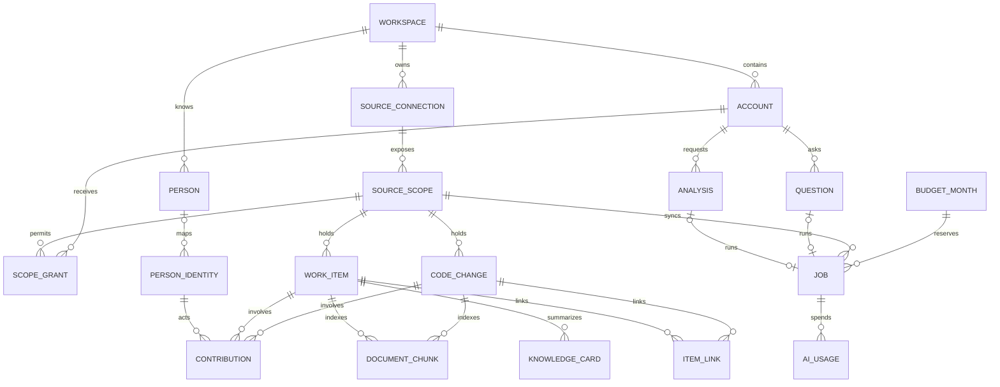
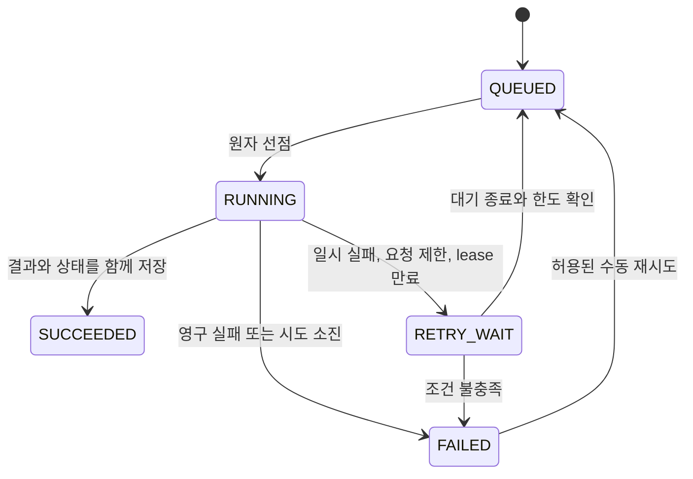

# ERD와 상태 전이

버전 0.2 · 단일 서버 MVP의 논리 설계 · [기능명세서와 유즈케이스](01-functional-spec.md)

## 1. 저장 원칙

PostgreSQL과 pgvector 확장을 사용한다. UUID PK, UTC timestamp, 금액은 정수 microUsd(1달러=1000000)를 사용한다. 업무 행에는 workspace_id와 scope_id가 필수이며 관계를 따라 같은 workspace인지 검사한다. API camelCase와 DB snake_case는 DTO로 변환한다.

외부 자료는 원본의 불변 ID로 식별한다. Jira는 issue id, GitHub는 저장소 id와 PR id를 쓴다. 이슈 키(PAY-142)와 저장소 이름(owner/repo)은 바뀔 수 있는 표시 속성이다. 원문은 화면 표시와 재색인을 위해 저장하고, 임베딩과 외부 AI에는 마스킹본만 쓴다. 아래는 논리 설계이며 실행 가능한 migration은 구현 때 작성한다.

## 2. ERD

CONTRIBUTION과 DOCUMENT_CHUNK는 WORK_ITEM과 CODE_CHANGE 중 하나만 가리킨다. JOB의 대상(scope, analysis, question, work_item)도 kind에 맞는 하나만 존재한다. 이 조건은 CHECK 제약과 서비스 검증을 함께 적용한다.

## 3. 핵심 필드와 제약

공통 id/workspace_id/created_at은 표에서 생략했다. `?`는 nullable이다.

| 테이블 | 주요 필드 | 반드시 지킬 제약 |
| --- | --- | --- |
| workspace / account | name / login_id, password_hash, role(MEMBER/ADMIN), active, must_change_password | 로그인 ID는 조직 안에서 unique. 비밀번호 원문 저장 금지 |
| source_connection | kind(JIRA_CLOUD/GITHUB), site_id?, base_url, credential_ref, status, last_error_code? | credential_ref는 환경 비밀값 이름만 저장. 토큰 값 저장 금지. Jira는 workspace 안에서 unique(kind, site_id)로 같은 사이트 중복 연결 금지 |
| source_scope | connection_id, external_id, display_key, enabled, sync_cursor JSONB, last_synced_at?, last_reconciled_at? | unique(connection, external_id). Jira 프로젝트 또는 GitHub 저장소 1개 |
| scope_grant | scope_id, account_id | unique(scope, account). MEMBER에게 필요, ADMIN은 조직 전체 |
| person | display_name, active, recommendable | 연락 추천은 active이면서 recommendable일 때만. 데이터 생성·봇 계정은 recommendable=false |
| person_identity | person_id?, kind, connection_id, external_id, display_name | unique(connection, kind, external_id). kind는 JIRA_ACCOUNT/GITHUB_USER/GIT_AUTHOR. GIT_AUTHOR는 정규화한 커밋 이메일로 식별하되 이메일은 화면·AI 입력에 쓰지 않음. person_id null은 미연결, 자동 병합 금지 |
| work_item | source_connection_id, scope_id, external_id, issue_key, title, body, body_masked, type, status, resolution?, labels, components, comments JSONB, resolved_at?, source_updated_at, content_hash, visibility, url | unique(source_connection_id, external_id). external_id는 불변 Jira issue id. scope의 connection과 일치해야 함. 이동 시 같은 행의 scope·키 갱신. 댓글은 최근 20개 |
| code_change | scope_id, external_id, number, title, body, body_masked, head_branch, state, merged_at?, commits JSONB, files JSONB, source_updated_at, content_hash, visibility, url | unique(scope, external_id). 커밋 100개·파일 300개 상한, diff 본문 없음 |
| contribution | identity_id, work_item_id?/code_change_id?, role, occurred_at | 대상 하나만. role은 ASSIGNEE/PR_AUTHOR/REVIEWER/COMMIT_AUTHOR/COMMENTER. unique(identity, 대상, role) |
| item_link | work_item_id, code_change_id, kind, status, evidence JSONB, score?, decided_by/at?, revision | unique(work_item, code_change). kind는 EXPLICIT/SUGGESTED. REJECTED 쌍 재제안 금지 |
| document_chunk | work_item_id?/code_change_id?, scope_id, part, ordinal, text_masked, token_count, content_hash, embedding_model, embedding vector | unique(대상, part, ordinal, embedding_model). 한 검색에서는 한 모델 벡터만 비교 |
| knowledge_card | work_item_id, source_hash, source_basis JSONB, access_scope_ids, model/prompt/schema 버전, body JSONB, status | 캐시 키는 work_item, source_hash, prompt_version, access_scope_ids를 포함. 문장마다 근거 ID. 원본 변경 시 STALE. 공용 카드도 조회자별 근거 전체 접근 검사 |
| analysis | requested_by, input_kind, input_text, input_work_item_id?, scope_snapshot, result JSONB?, basis_synced_at?, job_id | input_kind는 ISSUE_KEY/TEXT. 결과 조회 시 현재 권한으로 다시 거름 |
| question | requested_by, text, scope_filter, scope_snapshot, result JSONB?, job_id | result에 disposition/answer/citations/personIds. 완료 결과 불변 |
| result_feedback | account_id, analysis_id?/question_id?, target_type, target_id, verdict, note? | unique(account, 요청, target). verdict는 HELPFUL/NOT_RELEVANT |
| job | kind, status, 대상 ID, stage?, attempt_count, owner_id?, run_token?, lease_expires_at?, next_run_at, error_code?, snapshot JSONB, month_key, residual_micro_usd | kind는 SYNC/RECONCILE/INDEX/ANALYSIS/QUESTION/CARD/LINK_SUGGEST. scope당 활성 SYNC 1개 |
| budget_month | month_key, limit_micro_usd, held_micro_usd, settled_micro_usd, 건수와 한도 | PK(workspace, month). 잠금 안에서 건수·금액 검사 |
| ai_usage | job_id, stage, attempt_no, call_no, purpose, status, max_micro_usd, actual_micro_usd?, provider_request_id?, usage JSONB | unique(job, stage, attempt, call). RESERVED/SENT/SETTLED/RELEASED/UNKNOWN |
| execution_slot | slot_key, job_id?, run_token?, lease_expires_at? | 서버 전체 PK(slot_key): SYNC/INDEX/AI 고정 3행. 슬롯당 실행 작업 1개. 작업과 슬롯의 소유권은 같은 transaction에서 변경 |

중복 HTTP 요청은 별도 `idempotency_record`에 `(workspace, actor, operation, target, key)` unique, 요청 hash, 결과 resourceId를 기록한다. 세션은 Spring Session JDBC 표준 테이블을 사용한다. 이 둘은 보조 테이블이라 ERD에서 생략했다.

analysis·question의 result에는 유형별 항목 ID, AI 생성 텍스트, 근거 ID와 생성물별 source_basis를 저장한다. source_basis는 최종 인용뿐 아니라 생성 입력에 사용한 전체 원본의 type/id/contentHash/sourceUpdatedAt/scopeId를 기록한다. 제목·이름 등 표시값은 현재 권한과 visibility를 검사한 뒤 채운다.

생성물(요약·답변·요청 해석·관련도 이유·공용 카드)의 source_basis 중 하나라도 현재 접근 불가 또는 HIDDEN이면 해당 생성물 전체를 응답에서 제외한다. 숨긴 근거 ID·개수도 반환하지 않는다. 목록은 안전하게 표시 가능한 항목만 남기며 관련도 이유의 근거가 차단된 후보는 카드 전체를 제외한다. 사람은 남은 근거로 재계산한다. 권한 검사와 별도로 원본 버전 변경은 STALE로 표시하고 기존 분석·질문 본문을 자동 변경하지 않는다. 공용 요약 카드의 STALE 본문은 제공하지 않는다.

접근 제한은 저장된 완료 결과나 job 상태를 변경하지 않는 조회자별 표시 상태다. 재생성은 사용자의 명시 요청과 예산 검사를 거치고 현재 허용된 자료만 사용한다. 새 분석·질문은 새 ID로 저장하고 카드도 접근 범위별로 캐시를 구분한다.

## 4. 상태 전이

SUCCEEDED는 재선점하지 않는다. 수동 재시도도 같은 jobId·누적 시도·입장월을 유지하고 사용량 불명일 때는 거절한다. SYNC 성공은 커서 전진, ANALYSIS 성공은 결과 저장이며 결과가 비어 있어도 성공이다.

| 대상 | 상태와 의미 |
| --- | --- |
| 연결 | ACTIVE ↔ ERROR(인증·설정 오류, 자동 재시도 중단), DISABLED |
| scope | enabled 켜짐·꺼짐. 꺼지면 신규 수집을 멈추고 검색에서 제외 |
| 자료 visibility | ACTIVE → HIDDEN(원본 삭제·접근 불가·scope 비활성) → 재확인 시 ACTIVE |
| 명시 연결 | ACTIVE → STALE(원본에서 키가 사라짐) → 키가 다시 나타나면 ACTIVE |
| 추정 연결 | SUGGESTED → CONFIRMED 또는 REJECTED. 결정은 재동기화로 바뀌지 않음 |
| 요약 카드 | READY → STALE(원본 또는 명시·확정 연결 변경) → 새 카드 READY |
| 식별자 | person_id 없음(미연결) → 연결(스크립트), 해제 가능 |

## 5. 동기화·색인·복구 최소 규칙

증분 동기화 커서는 마지막으로 처리한 원본 수정 시각과 그 시각의 마지막 ID다. 다음 조회는 커서보다 10분 앞에서 시작하고 unique upsert로 중복을 흡수한다. 원본 수정 시각이 저장값보다 오래되면 덮어쓰지 않는다. 커서는 해당 페이지의 upsert와 같은 transaction에서 전진하므로 재시작해도 누락되지 않는다.

정합성 점검(RECONCILE)은 scope의 현재 ID 목록을 받아 DB와 비교하고 사라진 자료를 HIDDEN으로 바꾼다. 증분 조회로는 삭제를 알 수 없기 때문이다. HIDDEN 자료는 30일 후 본문·청크를 삭제한다.

Jira upsert는 프로젝트가 아닌 (source_connection_id, external_id)로 기존 행을 찾는다. 등록된 프로젝트로 이동하면 work_item.id를 보존하고 scope_id·issue_key·url과 청크 scope를 같은 transaction에서 갱신한다. 기존 연결·검토 결정·피드백은 유지하고 권한은 새 scope 기준으로 검사한다. 미등록 프로젝트로 이동하거나 원본 접근을 잃으면 HIDDEN 처리하고 새 자료로 복제하지 않는다. 미등록 이동 시 마지막 등록 scope는 보관하되 공개 권한으로 사용하지 않는다. 이전 scope의 정합성 점검이 이미 이동한 행을 숨기지 않도록 현재 scope 일치 조건을 검사한다.

content_hash가 바뀐 자료만 INDEX job을 만든다. 수정 시각만 바뀌고 내용이 같으면 재임베딩하지 않는다. 임베딩 모델을 바꾸면 새 모델 청크를 모두 만든 뒤 설정을 전환하고 이전 벡터는 전환 후 삭제한다.

검색 SQL은 scope 조건을 벡터 정렬보다 먼저 적용한다. 초기에는 ANN 인덱스 없이 정확한 거리 계산을 쓰고, 청크 수와 지연을 측정한 뒤 HNSW 인덱스 도입을 결정한다. 인덱스를 쓸 때는 scope 필터와 함께 결과가 빠지지 않는지 검증한다.

worker는 공통 execution_slot 확보와 QUEUED → RUNNING 선점을 같은 transaction에서 수행한다. SYNC 슬롯은 SYNC/RECONCILE, INDEX 슬롯은 INDEX, AI 슬롯은 ANALYSIS/QUESTION/CARD/LINK_SUGGEST를 담당한다. 각 슬롯은 workspace·scope·kind와 무관하게 서버 전체 1개이며 INDEX 임베딩과 AI 작업은 동시에 실행 가능하다. ANALYSIS/QUESTION의 질의 임베딩은 AI 슬롯 안에서 수행한다. SYNC는 수집 후 INDEX를, INDEX는 필요 시 LINK_SUGGEST를 별도 job으로 등록하고 슬롯을 반납한다. 다른 슬롯을 잡은 채 자식 작업 완료를 기다리지 않는다.

lease 120초·30초 갱신을 제안한다. job과 슬롯의 lease·run_token을 함께 갱신하며 만료된 lease는 되살리지 않는다. 완료·대기·실패 전환과 슬롯 해제도 원자적으로 수행한다. 만료 복구는 이전 job의 SENT/UNKNOWN 비용 상태를 먼저 반영하고, 새 run_token으로 재선점한다. 이전 실행기의 heartbeat·결과·커서·슬롯 해제는 job과 슬롯 양쪽의 run_token 및 유효 lease 검사로 거절한다. 슬롯을 얻지 못한 작업은 QUEUED로 남고 시도 횟수를 소비하지 않는다.

잠금 순서는 idempotency → budget_month → scope → work_item/code_change → item_link → execution_slot → job → ai_usage로 고정한다. Jira·GitHub·AI 외부 호출 중에는 DB lock을 유지하지 않는다. grant 회수와 scope 비활성은 다음 외부 호출과 결과 저장 전에 다시 확인한다.

관련: [API 명세서](04-api-spec.md) · [AI 처리 명세서](05-ai-processing.md) · [테스트 체크리스트](06-test-checklist.md)
